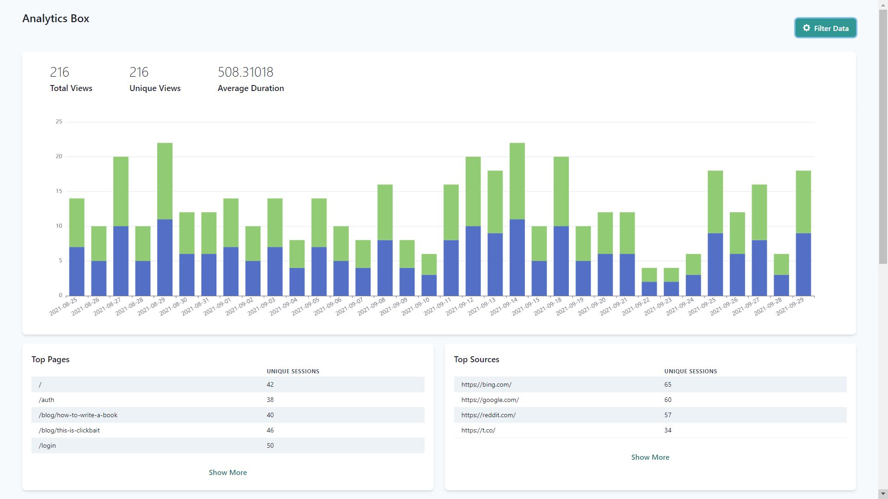

# Analytics Box

Hello guys, this is privacy friendly analytics tool, Analytics Box for web written in go. It ensures user privacy but at the same time also provides key metrics that will ensure your business does good while keeping user privacy in mind.

**Important**: Analytics box now has a dashboard tailored to its use, it is not complete tho it lacks features like filters which are implemented on backend and is matter of time before they are made working in frontend.

### What is Analytics Box ?

Analytics box is analytics tool like google analytics but instead of ripping user's privacy off them like google it respects their privacy and doesn't collect any unnecessary information.

### Features
1. No Cookies.
2. Can track unique page views effectively without hurting user's privacy, no fingerprinting user.
3. Custom events are supported.
4. Super simple to setup. ( 1 go binary + 1 super small script on frontend ).
5. Super low resource consumption.
6. Uses Postgres so it can scale without using a lot of resources.
7. Only requires postgres for production.

Docs comming soon.
