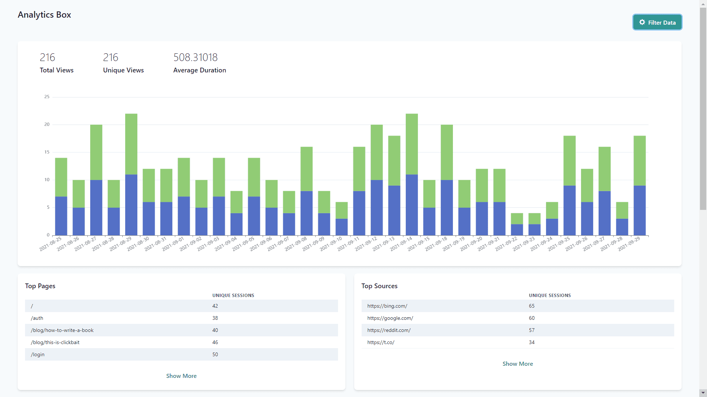
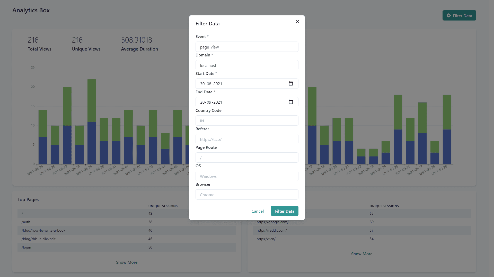
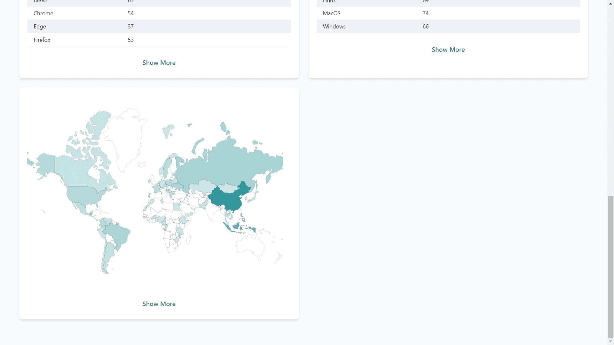
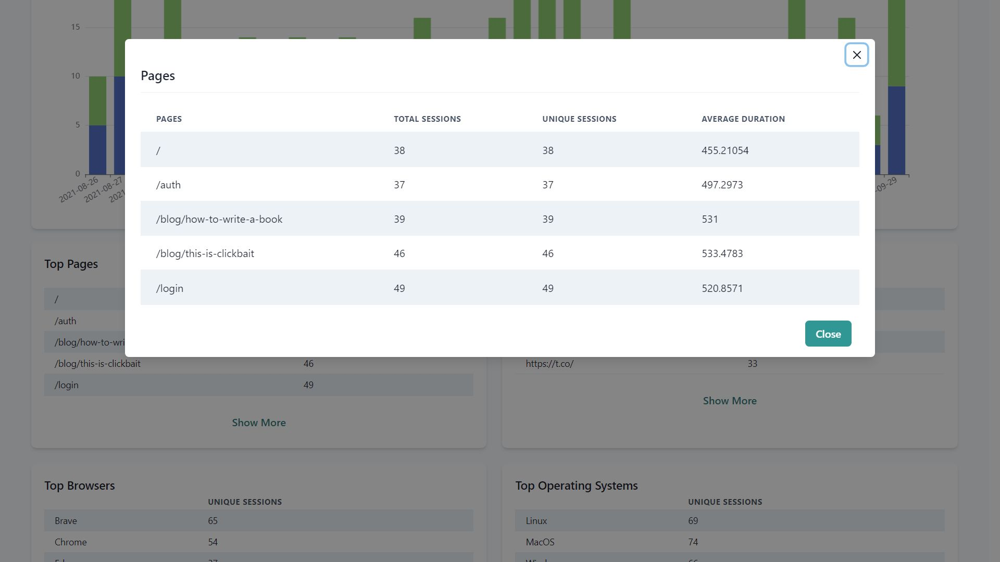

# 📊 Analytics Box



<details>
<summary>View more screenshots.</summary>
  

  



</details>
  
Hello everyone, welcome to **Analytics Box**, your privacy-friendly analytics tool for web applications, written in Go. Our tool is designed to prioritize user privacy while delivering essential metrics to help your business thrive.

You can easily integrate our tracking script via CDN by adding the following to your HTML:

```html
<script src="https://cdn.jsdelivr.net/gh/ketanip/analytics-box/tracker/dist/index.js"></script>
```

### What is Analytics Box?

Analytics Box is an analytics solution similar to Google Analytics. However, unlike Google, we respect user privacy and refrain from collecting unnecessary personal information.

### Key Features 🌟

1. **Cookie Flexibility**: Analytics Box works seamlessly with and without cookies, ensuring users have choices when it comes to data tracking.

2. **No Fingerprinting**: We do not perform any server-side fingerprinting of users, safeguarding their anonymity.

3. **Effective Page Views Tracking**: We track unique page views without compromising user privacy, without employing fingerprinting techniques.

4. **Custom Event Tracking**: You can easily set up custom events to track specific user interactions on your website.

5. **Easy Setup**: Setting up Analytics Box is a breeze – just one Go binary and a small frontend script, and you're good to go!

6. **Minimal Resource Consumption**: We are designed to be resource-efficient, ensuring your server's performance remains top-notch.

7. **Scalable with Postgres**: Analytics Box utilizes Postgres, allowing for significant scalability without excessive resource consumption.

Give Analytics Box a try, and elevate your analytics game while respecting user privacy! 🚀🔒
