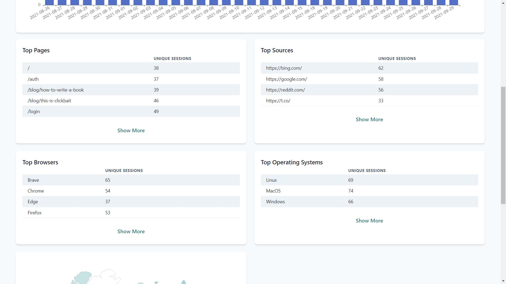
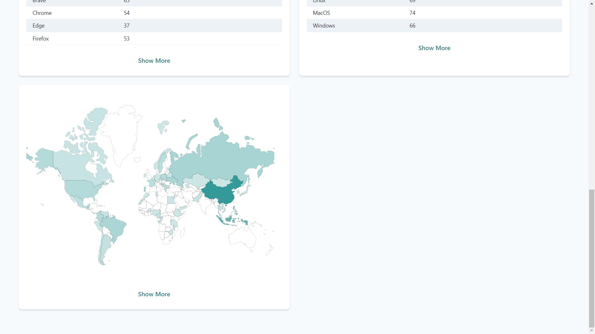

# Analytics Box

Hello guys, this is privacy friendly analytics tool, Analytics Box for web written in go. It ensures user privacy but at the same time also provides key metrics that will ensure your business does good while keeping user privacy in mind.

**Important**: This project is mostly ready to use in production for now you can use a dashboard like Metabase with for dashboard. The dashboard will be added to this project but not soon as I've my exams. But backend it functional as per my knowledge it doesn't have any bugs, if you encounter you can just create a issue I will try to fix if I have some spare time or you can fix it and just create a pull request I'll merge it.

### What is Analytics Box ?

Analytics box is analytics tool like google analytics but instead of ripping user's privacy off them like google it respects their privacy and doesn't collect any unnecessary information.

### Features
1. No Cookies.
2. Can track unique page views effectively without hurting user's privacy, no fingerprinting user.
3. Custom events are supported.
4. Super simple to setup. ( 1 go binary + 1 super small script on frontend ).
5. Super low resource consumption.
6. Uses Postgres so it can scale without using a lot of resources.
7. Only requires postgres for production.

Docs comming soon.
